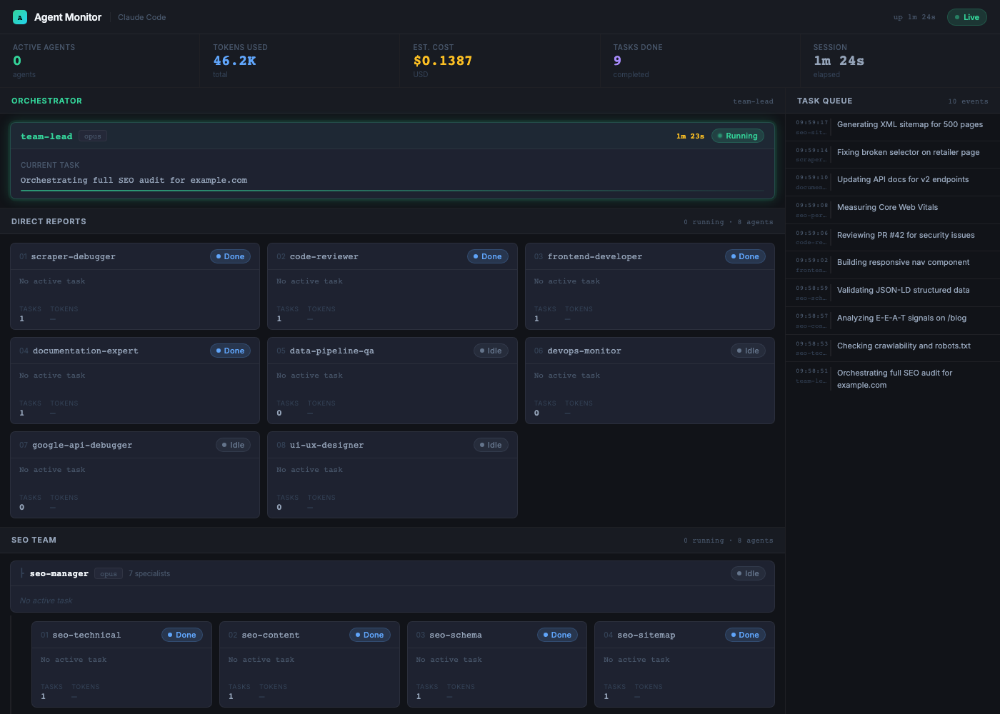
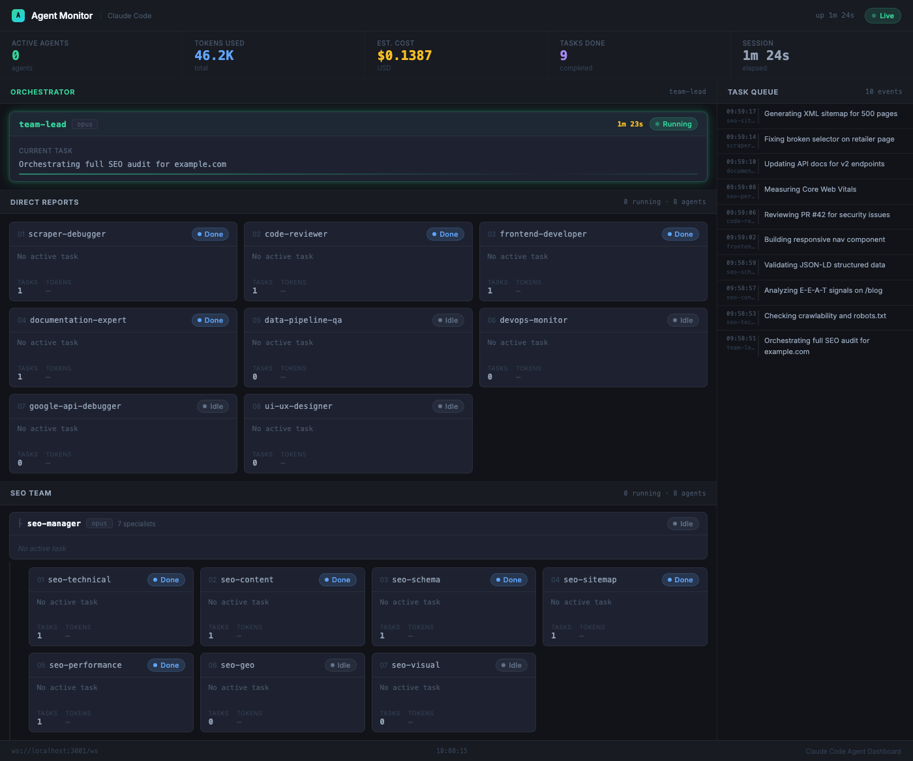

# Claude Code Agent Monitor

Real-time dashboard for monitoring Claude Code subagent activity. Built with Node.js and React, it captures lifecycle events from [Claude Code hooks](https://docs.anthropic.com/en/docs/claude-code/hooks), persists state to SQLite, and streams updates to connected browsers over WebSocket. Supports 17 agents with hierarchical visualization, a built-in demo mode, and works with any Claude Code multi-agent setup.

---

## Features

- **Real-time monitoring** -- WebSocket push on every agent state change, no polling required
- **Claude Code hook integration** -- captures `PreToolUse` and `PostToolUse` events from the Agent tool automatically
- **Hierarchical agent view** -- team-lead orchestrator at top, direct reports in one group, seo-manager sub-orchestrator with 7 SEO specialists nested underneath
- **SQLite persistence** -- agent state, metrics, and task history survive server restarts
- **Token and cost tracking** -- extracts usage data from hook responses, tracks per-agent and global totals
- **Auto-reconnect** -- frontend reconnects with exponential backoff (1s-15s) if the server restarts
- **Metric strip** -- total tokens, estimated cost, active agent count, completed tasks, session uptime
- **Demo mode** -- simulates agent activity without Claude Code running; useful for UI testing and demos
- **REST API** -- `POST /api/event` to inject events, `GET /api/state` to snapshot, `POST /api/reset` to clear state
- **Minimal dependencies** -- server requires `ws` and `better-sqlite3`; frontend uses React 19 and Vite

---

## Screenshots

### Dashboard overview (demo mode)



### Full agent grid with task queue



---

## Quick Start

### 1. Clone and install

```bash
git clone https://github.com/yourusername/claude-code-agent-monitor.git
cd claude-code-agent-monitor
npm install
cd frontend && npm install && cd ..
```

### 2. Start the server

```bash
# Live mode -- waits for hook events from Claude Code
node claude-dashboard-server.js

# Demo mode -- simulates agent activity (no hooks required)
node claude-dashboard-server.js --demo
```

The server starts on port 3001. Output:

```
Claude Code Agent Dashboard Server
-----------------------------------
WebSocket : ws://localhost:3001/ws
API state : http://localhost:3001/api/state
Post event: http://localhost:3001/api/event
Health    : http://localhost:3001/health
Mode      : LIVE (waiting for hook events)
```

### 3. Start the frontend

In a second terminal:

```bash
cd frontend
npm run dev
```

Open `http://localhost:5173` in a browser. The dashboard connects to the WebSocket automatically.

---

## Architecture

```
Claude Code (Agent tool)
        |
        | PreToolUse / PostToolUse hooks
        v
dashboard-agent-event.sh
        |
        | POST /api/event  (fire-and-forget, 2s timeout)
        v
claude-dashboard-server.js  (Node.js, port 3001)
        |
        | in-memory agentState object
        |
        +---> GET /api/state       (snapshot poll)
        |
        +---> WebSocket /ws        (push on every state change)
                    |
                    v
         React frontend (Vite, port 5173)
         ClaudeCodeDashboard.jsx
                    |
                    +-- MetricStrip      (tokens, cost, active agents, tasks done, session time)
                    +-- TeamLeadCard     (orchestrator status + current task)
                    +-- SpecialistCard   (grid, one card per specialist)
                    +-- TaskQueue        (last 10 events, right column)
```

---

## API Reference

### HTTP Endpoints

| Method | Path | Description |
|--------|------|-------------|
| `GET` | `/api/state` | Returns the full `agentState` object as JSON |
| `POST` | `/api/event` | Accepts an event object; updates state and broadcasts via WebSocket |
| `GET` | `/health` | Returns `{"status":"ok","demo":<bool>,"timestamp":<ms>}` |
| `OPTIONS` | `*` | CORS preflight -- all origins permitted |

All responses include `Access-Control-Allow-Origin: *`.

### POST /api/event

Request body (JSON):

```json
{
  "type":   "agent_start | agent_complete | agent_idle",
  "agent":  "<agent-name>",
  "task":   "<task description>",
  "tokens": 1500
}
```

| Field | Type | Required | Description |
|-------|------|----------|-------------|
| `type` | string | yes | One of `agent_start`, `agent_complete`, `agent_idle` |
| `agent` | string | yes | Must match a name in the agent team list |
| `task` | string | no | Human-readable task description |
| `tokens` | number | no | Token count to add to global totals |

Event type effects:

| Type | Effect |
|------|--------|
| `agent_start` | Sets status to `running`, records `startTime`, appends task to queue |
| `agent_complete` | Sets status to `completed`, increments `taskCount` and `completedTasks` |
| `agent_idle` | Sets status to `idle`, clears `currentTask` |

### WebSocket

Connect to `ws://localhost:3001/ws`. On connection, the server sends the current full state. After every `POST /api/event`, it broadcasts to all clients:

```json
{
  "type":      "state_update",
  "payload":   { "teamLead": {}, "specialists": {}, "globalMetrics": {}, "taskQueue": [] },
  "timestamp": 1714000000000
}
```

Cost is estimated at $3.00 per 1M tokens.

---

## Hook Integration

Claude Code hooks allow external scripts to run on specific lifecycle events. This dashboard uses `PreToolUse` and `PostToolUse` hooks on the `Agent` tool to capture subagent start and completion events.

### How it works

1. Claude Code invokes the `Agent` tool to delegate work to a subagent
2. The `PreToolUse` hook fires, the script reads `tool_input.subagent_type` and `tool_input.description` from stdin
3. The script POSTs an `agent_start` event to `/api/event`
4. When the subagent finishes, `PostToolUse` fires and the script POSTs `agent_complete`

Both `curl` calls use `--connect-timeout 1 --max-time 2` and run in the background, so a missing or slow dashboard server never blocks Claude Code.

### Hook payload (stdin)

| Field | Used as |
|-------|---------|
| `hook_event_name` | `PreToolUse` maps to `agent_start`; `PostToolUse` maps to `agent_complete` |
| `tool_input.subagent_type` | Dashboard `agent` field (e.g. `seo-technical`) |
| `tool_input.description` | Dashboard `task` field |

### Installing the hooks

**1. Create the hook script**

```bash
mkdir -p ~/.claude/hooks
cp dashboard-agent-event.sh ~/.claude/hooks/
chmod +x ~/.claude/hooks/dashboard-agent-event.sh
```

**2. Add hooks to `~/.claude/settings.json`**

```json
{
  "hooks": {
    "PreToolUse": [
      {
        "matcher": "Agent",
        "hooks": [
          {
            "type": "command",
            "command": "/absolute/path/to/.claude/hooks/dashboard-agent-event.sh"
          }
        ]
      }
    ],
    "PostToolUse": [
      {
        "matcher": "Agent",
        "hooks": [
          {
            "type": "command",
            "command": "/absolute/path/to/.claude/hooks/dashboard-agent-event.sh"
          }
        ]
      }
    ]
  }
}
```

Replace the path with the absolute path to your hook script. Relative paths are not supported by Claude Code.

### Testing manually

```bash
curl -s -X POST http://localhost:3001/api/event \
  -H 'Content-Type: application/json' \
  -d '{"type":"agent_start","agent":"seo-technical","task":"Checking robots.txt","tokens":1200}'
```

---

## Configuration

### Server port

The server reads `DASHBOARD_PORT` from the environment. Default is `3001`.

```bash
DASHBOARD_PORT=4000 node claude-dashboard-server.js
```

If you change the port, update the WebSocket URL in `frontend/src/ClaudeCodeDashboard.jsx` (two occurrences of `localhost:3001/ws`).

### Demo mode

```bash
node claude-dashboard-server.js --demo
```

Fires 10 pre-defined tasks at 2-4 second intervals, randomly completing agents as new ones start. State is not persisted -- restarting the server resets everything.

### Adding or renaming agents

Edit the `agentTeam` array at the top of `claude-dashboard-server.js`:

```js
const agentTeam = [
  'team-lead',
  'scraper-debugger',
  // ... add or remove entries here
];
```

Rules:
- The first entry (`team-lead`) is the orchestrator, rendered in `TeamLeadCard`. All others are specialists.
- Model is set to `sonnet` for indices 1-8 and `inherited` for 9+. Adjust the condition in the `forEach` loop if needed.
- Agent names in `POST /api/event` must exactly match entries in this array or they are silently ignored.

---

## Agent Team

The dashboard visualizes a two-level hierarchy: **team-lead** orchestrates all agents, while **seo-manager** acts as a sub-orchestrator for the 7 SEO specialists.

```
team-lead (Opus)
├── scraper-debugger
├── data-pipeline-qa
├── devops-monitor
├── google-api-debugger
├── code-reviewer
├── ui-ux-designer
├── frontend-developer
├── documentation-expert
└── seo-manager (sub-orchestrator)
    ├── seo-technical
    ├── seo-content
    ├── seo-schema
    ├── seo-sitemap
    ├── seo-geo
    ├── seo-performance
    └── seo-visual
```

### Direct Reports

| # | Agent | Role |
|---|-------|------|
| 01 | `scraper-debugger` | Diagnoses and fixes broken web scrapers and CSS selectors |
| 02 | `data-pipeline-qa` | Validates data extraction, transformation, and pipeline integrity |
| 03 | `devops-monitor` | Monitors infrastructure, logs, and deployment health |
| 04 | `google-api-debugger` | Debugs Google API integrations (Search Console, Analytics) |
| 05 | `code-reviewer` | Reviews PRs for correctness, security, and style |
| 06 | `ui-ux-designer` | Produces UI specifications and component designs |
| 07 | `frontend-developer` | Implements React/JS components and frontend features |
| 08 | `documentation-expert` | Writes and maintains technical documentation |

### SEO Team (managed by seo-manager)

| # | Agent | Role |
|---|-------|------|
| -- | `seo-manager` | Sub-orchestrator -- coordinates SEO specialists and prioritizes SEO tasks |
| 09 | `seo-technical` | Crawlability, indexability, robots.txt, canonical tags |
| 10 | `seo-content` | E-E-A-T signals, content quality, keyword alignment |
| 11 | `seo-schema` | JSON-LD structured data and schema validation |
| 12 | `seo-sitemap` | XML sitemap generation and submission |
| 13 | `seo-geo` | Hreflang, geo-targeting, international SEO |
| 14 | `seo-performance` | Core Web Vitals, page speed, rendering performance |
| 15 | `seo-visual` | Image optimization, alt text, visual search signals |

---

## File Structure

```
claude-code-agent-monitor/
├── claude-dashboard-server.js    # Node.js HTTP + WebSocket server
├── package.json                  # Server dependencies (ws)
├── dashboard-agent-event.sh      # Hook script for Claude Code
├── screenshots/
│   ├── dashboard-top.png
│   └── dashboard-full.png
└── frontend/
    ├── package.json              # React 19, Vite 6
    └── src/
        ├── main.jsx
        ├── App.jsx
        ├── ClaudeCodeDashboard.jsx  # Full dashboard UI
        ├── App.css
        └── index.css
```

---

## Troubleshooting

### Dashboard shows "Connecting to ws://localhost:3001..."

The browser cannot reach the server.

```bash
curl http://localhost:3001/health
lsof -i :3001
```

### "Waiting for data..." with server running

WebSocket connected but no events received. Expected in live mode until Claude Code invokes an agent. Use `--demo` or send a manual event:

```bash
curl -s -X POST http://localhost:3001/api/event \
  -H 'Content-Type: application/json' \
  -d '{"type":"agent_start","agent":"team-lead","task":"Test task"}'
```

### Hook events not appearing

1. Confirm the server is running before starting Claude Code
2. Verify `jq` and `curl` are installed: `which jq curl`
3. Test the hook script directly:

```bash
echo '{"hook_event_name":"PreToolUse","tool_input":{"subagent_type":"seo-technical","description":"Test"}}' \
  | bash ~/.claude/hooks/dashboard-agent-event.sh
```

4. Check the script is executable: `chmod +x ~/.claude/hooks/dashboard-agent-event.sh`
5. Verify the absolute path in `~/.claude/settings.json` matches the script location

### Agent events silently dropped

The `agent` field must exactly match one of the 17 names in `agentTeam` in `claude-dashboard-server.js`. If your agents use different `subagent_type` values, update the hook script or add new names to `agentTeam`.

### Port 3001 already in use

```bash
lsof -i :3001
DASHBOARD_PORT=3002 node claude-dashboard-server.js
```

Then update the WebSocket URL in `ClaudeCodeDashboard.jsx`.

### Resetting state

State lives in server memory. Restart the server to reset:

```bash
kill $(lsof -ti :3001)
node claude-dashboard-server.js
```

---

## Prerequisites

| Requirement | Version | Notes |
|-------------|---------|-------|
| Node.js | 18+ | Server and frontend build tooling |
| npm | 9+ | Bundled with Node.js 18 |
| Claude Code | any | Required only for live hook events |
| `jq` | any | Used by the hook script to parse JSON |
| `curl` | any | Used by the hook script to POST events |

---

## Contributing

1. Fork the repository
2. Create a feature branch: `git checkout -b feature/your-feature`
3. Make your changes and test with `--demo` mode
4. Submit a pull request with a clear description of the change

Bug reports and feature requests are welcome via GitHub Issues.

---

## License

MIT
